# Internal Audit Validation System

An end-to-end GenAI workflow demonstrating **multi-agent orchestration**, **RAG (Retrieval-Augmented Generation)**, and **multi-provider LLM integration**. Built with crewAI, this system connects LLMs with local document library to validate audit observations against Hong Kong regulatory policies (HKMA and SFC). Features a 5-stage pipeline with parallel retrieval, reflection-revision quality loops, and automated evaluation.

## Key Features

| Capability | Implementation |
|------------|----------------|
| **End-to-End GenAI Workflow** | 5-stage sequential pipeline with parallel retrieval |
| **Multi-Agent Architecture** | 4 specialized agents with distinct roles and tools |
| **RAG (Retrieval-Augmented Generation)** | Web search, PDF extraction, document parsing |
| **Multi-Provider LLM Support** | OpenAI, Anthropic, Google, DeepSeek, Groq, Ollama |
| **Internal Data Integration** | Connects LLMs with proprietary audit observations |
| **Quality Assurance** | Reflection-revision loop with automated evaluation |


## Workflow Architecture

```mermaid
flowchart TD
    Start([Start: User Input]) --> Input[/"Audit Observation (String)"/]

    Input --> Stage1{Stage 1: Parallel Policy Retrieval}

    %% Stage 1: Parallel Retrieval
    Stage1 --> HKMA[HKMA Policy Retrieval Specialist]
    Stage1 --> SFC[SFC Policy Retrieval Specialist]

    HKMA --> HKMATools{Tool Selection}
    HKMATools -->|Local Files| FileRead1[RobustFileReadTool]
    HKMATools -->|Web Search| Serper1[SerperDevTool]
    Serper1 -->|HTML Page| WebScrape1[SecureWebScraperTool]
    Serper1 -->|PDF Document| PDFDown1[PDFDownloadTool]

    FileRead1 --> HKMAOut[/"HKMA Policy Table (MD)"/]
    WebScrape1 --> HKMAOut
    PDFDown1 --> HKMAOut

    SFC --> SFCTools{Tool Selection}
    SFCTools -->|Local Files| FileRead2[RobustFileReadTool]
    SFCTools -->|Web Search| Serper2[SerperDevTool]
    Serper2 -->|HTML Page| WebScrape2[SecureWebScraperTool]
    Serper2 -->|PDF Document| PDFDown2[PDFDownloadTool]

    FileRead2 --> SFCOut[/"SFC Policy Table (MD)"/]
    WebScrape2 --> SFCOut
    PDFDown2 --> SFCOut

    HKMAOut --> Stage2
    SFCOut --> Stage2

    %% Stage 2: Aggregation
    Stage2[Stage 2: Policy Aggregation] --> Aggregator[Policy Aggregator Agent]
    Aggregator --> Consolidate[Consolidate HKMA + SFC Tables]
    Consolidate --> Dedupe[Deduplicate Overlapping Policies]
    Dedupe --> Verify[Verify Completeness & Consistency]
    Verify --> AggOut[/"Consolidated Policy Table (MD)<br/>8-Column Format"/]

    AggOut --> Stage3

    %% Stage 3: Reflection
    Stage3[Stage 3: Quality Reflection] --> Reviewer1[Senior Audit Reviewer Agent]
    Reviewer1 --> ValidateCite[Validate Citations & Excerpts]
    ValidateCite --> CheckDates[Check Dates & URLs]
    CheckDates --> IdentifyGaps[Identify Gaps & Weaknesses]
    IdentifyGaps --> ReflectDecision{Quality Check}

    ReflectDecision -->|All Checks Pass| PassVerdict[/"PASS Verdict + Feedback"/]
    ReflectDecision -->|Issues Found| RevisionVerdict[/"NEEDS REVISION Verdict<br/>+ Improvement Feedback"/]

    PassVerdict --> Stage4
    RevisionVerdict --> Stage4

    %% Stage 4: Revision
    Stage4[Stage 4: Policy Revision] --> Aggregator2[Policy Aggregator Agent]
    Aggregator2 --> RevisionStrategy{Revision Strategy}

    RevisionStrategy -->|PASS Verdict| MinorPolish[Minor Polishing Only]
    RevisionStrategy -->|Critical Gaps| AdditionalResearch[Additional Research with Tools]
    RevisionStrategy -->|Other Issues| RefineEntries[Refine Existing Entries]

    AdditionalResearch --> UseTools[Use RobustFileRead/<br/>SecureWebScraper/<br/>PDFDownload as needed]
    UseTools --> FinalTable

    MinorPolish --> FinalTable[/"Final Policy Table (MD)<br/>Audit-Ready"/]
    RefineEntries --> FinalTable

    FinalTable --> Stage5Decision{Analysis Stage<br/>Enabled?}

    %% Stage 5: Compliance Analysis (Currently Disabled)
    Stage5Decision -->|No Current| EndDisabled([End: Policy Retrieval Complete])
    Stage5Decision -->|Yes When Enabled| Stage5[Stage 5: Compliance Analysis]

    Stage5 --> AnalysisExpert[Audit Analysis Expert Agent]
    AnalysisExpert --> AnalyzeCompliance[Analyze Against Policies]
    AnalyzeCompliance --> ComplianceDecision{Compliance Status}

    ComplianceDecision -->|Violation Found| NonCompliant[Non-Compliant Classification]
    ComplianceDecision -->|Meets Requirements| Compliant[Compliant Classification]
    ComplianceDecision -->|Partial Match| PartialCompliant[Partial Compliance Classification]

    NonCompliant --> CompAnalysisOut
    Compliant --> CompAnalysisOut
    PartialCompliant --> CompAnalysisOut

    CompAnalysisOut[/"Compliance Analysis Report (MD)<br/>+ Risk Assessment"/] --> ReviewTask

    ReviewTask[Review Task] --> Reviewer2[Senior Audit Reviewer Agent]
    Reviewer2 --> AssessAdequacy[Assess Analysis Adequacy]
    AssessAdequacy --> CheckEvidence[Check Evidence Completeness]
    CheckEvidence --> SignOffDecision{Sign-off Ready?}

    SignOffDecision -->|Adequate| ReadyApproval[/"Ready for Approval"/]
    SignOffDecision -->|Needs Work| NeedsRevision[/"Needs Revision<br/>+ Deficiencies List"/]

    ReadyApproval --> EndEnabled
    NeedsRevision --> EndEnabled

    EndEnabled([End: Full Analysis Complete])

    %% Output Management
    FinalTable -.-> OutputDir[/"Output Directory:<br/>output/{timestamp}/"/]
    CompAnalysisOut -.-> OutputDir

    OutputDir -.-> OutputFiles["Generated Files:<br/>- hkma_policy_retrieval.md<br/>- sfc_policy_retrieval.md<br/>- policy_retrieval_aggregated.md<br/>- retrieval_review.md<br/>- policy_retrieval_final.md<br/>- compliance_analysis.md (optional)<br/>- review_report.md (optional)"]

    %% Evaluation
    OutputFiles -.-> Evaluation[Evaluation Framework]
    Evaluation -.-> QualityChecks["Quality Checks:<br/>- Table structure validation<br/>- Content completeness<br/>- Citation accuracy<br/>- Risk assessment presence"]
    QualityChecks -.-> EvalOutput[/"evaluation/latest_report.json<br/>Pass Rate Score"/]

    %% Styling
    classDef agentClass fill:#4A90E2,stroke:#2E5C8A,stroke-width:2px,color:#fff
    classDef toolClass fill:#50C878,stroke:#2F7C4F,stroke-width:2px,color:#fff
    classDef outputClass fill:#FFB347,stroke:#CC8A38,stroke-width:2px,color:#000
    classDef decisionClass fill:#E94B3C,stroke:#A63429,stroke-width:2px,color:#fff
    classDef stageClass fill:#9B59B6,stroke:#6C3483,stroke-width:3px,color:#fff

    class HKMA,SFC,Aggregator,Reviewer1,Aggregator2,AnalysisExpert,Reviewer2 agentClass
    class FileRead1,FileRead2,Serper1,Serper2,WebScrape1,WebScrape2,PDFDown1,PDFDown2 toolClass
    class HKMAOut,SFCOut,AggOut,PassVerdict,RevisionVerdict,FinalTable,CompAnalysisOut,ReadyApproval,NeedsRevision,OutputDir,OutputFiles,EvalOutput outputClass
    class HKMATools,SFCTools,ReflectDecision,RevisionStrategy,Stage5Decision,ComplianceDecision,SignOffDecision decisionClass
    class Stage1,Stage2,Stage3,Stage4,Stage5 stageClass
```



```
┌─────────────────────────────────────────────────────────────────────────────┐
│                           OUTPUT STRUCTURE                                  │
├─────────────────────────────────────────────────────────────────────────────┤
│                                                                             │
│   output/YYYYMMDD_HHMMSS/                                                   │
│   ├── hkma_policy_retrieval.md      (Stage 1a)                              │
│   ├── sfc_policy_retrieval.md       (Stage 1b)                              │
│   ├── policy_retrieval_aggregated.md (Stage 2)                              │
│   ├── retrieval_review.md           (Stage 3)                               │
│   └── policy_retrieval_final.md     (Stage 4) ★ Final Deliverable           │
│                                                                             │
└─────────────────────────────────────────────────────────────────────────────┘
```

## Supported LLM Providers

This project uses crewAI with LiteLLM, supporting 100+ LLM providers. Change the `model` parameter in `crew.py` to switch providers.

| Provider | Model Format | Example |
|----------|--------------|---------|
| **OpenAI** | `gpt-*` | `gpt-4o-mini`, `gpt-4o`, `gpt-4-turbo` |
| **Anthropic** | `claude-*` | `claude-3-5-sonnet-20241022`, `claude-3-opus-20240229` |
| **Google** | `gemini/*` | `gemini/gemini-1.5-pro`, `gemini/gemini-1.5-flash` |
| **DeepSeek** | `deepseek/*` | `deepseek/deepseek-chat`, `deepseek/deepseek-coder` |
| **Azure OpenAI** | `azure/*` | `azure/gpt-4o` |
| **AWS Bedrock** | `bedrock/*` | `bedrock/anthropic.claude-3-sonnet` |
| **Ollama (local)** | `ollama/*` | `ollama/llama3`, `ollama/mistral` |
| **Groq** | `groq/*` | `groq/llama3-70b-8192` |

### Required Environment Variables

| Provider | Environment Variable |
|----------|---------------------|
| OpenAI | `OPENAI_API_KEY` |
| Anthropic | `ANTHROPIC_API_KEY` |
| Google | `GEMINI_API_KEY` |
| DeepSeek | `DEEPSEEK_API_KEY` |
| Azure | `AZURE_API_KEY`, `AZURE_API_BASE` |
| AWS Bedrock | `AWS_ACCESS_KEY_ID`, `AWS_SECRET_ACCESS_KEY` |
| Groq | `GROQ_API_KEY` |

**Current default:** `gpt-4o-mini` (OpenAI)

## Installation

Requires Python >=3.10 <3.14. This project uses [UV](https://docs.astral.sh/uv/) for dependency management.

```bash
# Install uv if not already installed
pip install uv

# Install dependencies
uv sync
# or
crewai install
```

## Configuration

### LLM Provider Setup

Create a `.env` file with API keys for your chosen provider(s):

```bash
# OpenAI (default)
OPENAI_API_KEY=your-openai-key

# Google Gemini
GEMINI_API_KEY=your-gemini-key

# Anthropic Claude
ANTHROPIC_API_KEY=your-anthropic-key

# Groq
GROQ_API_KEY=your-groq-key

# DeepSeek
DEEPSEEK_API_KEY=your-deepseek-key

# Azure OpenAI
AZURE_API_KEY=your-azure-key
AZURE_API_BASE=https://your-resource.openai.azure.com

# Web search (required for policy retrieval)
SERPER_API_KEY=your-serper-key
```

### Switching LLM Provider

Edit `src/internal_audit_validation_system/crew.py` and change the `model` parameter in each agent's LLM configuration:

```python
# OpenAI (default)
llm=LLM(model="gpt-4o-mini", temperature=0.7)

# Anthropic Claude
llm=LLM(model="claude-3-5-sonnet-20241022", temperature=0.7)

# Google Gemini
llm=LLM(model="gemini/gemini-1.5-flash", temperature=0.7)

# Groq (fast inference)
llm=LLM(model="groq/llama3-70b-8192", temperature=0.7)

# DeepSeek
llm=LLM(model="deepseek/deepseek-chat", temperature=0.7)

# Local Ollama
llm=LLM(model="ollama/llama3", temperature=0.7)
```

### Customizing Files

- `src/internal_audit_validation_system/config/agents.yaml` - Agent definitions
- `src/internal_audit_validation_system/config/tasks.yaml` - Task definitions
- `src/internal_audit_validation_system/crew.py` - Crew logic, tools, and LLM config
- `src/internal_audit_validation_system/main.py` - Custom inputs

## Running the Project

```bash
# Run the crew
python src/internal_audit_validation_system/main.py run
# or
crewai run

# Train the crew
python src/internal_audit_validation_system/main.py train <n_iterations> <filename>

# Replay from a specific task
python src/internal_audit_validation_system/main.py replay <task_id>

# Test with different models
python src/internal_audit_validation_system/main.py test <n_iterations> <model_name>
```

## Evaluating Task Quality

Use the evaluation harness to identify which task is degrading overall output:

```bash
python -m internal_audit_validation_system.evaluation.runner \
  --input-json evaluation/sample_payload.json \
  --write-report evaluation/latest_report.json
```

The CLI prints per-task pass rates across structural checks and writes detailed findings to the report.

## Documentation

See [CLAUDE.md](CLAUDE.md) for detailed development guidelines, architecture documentation, and configuration reference.

## Support

- [crewAI Documentation](https://docs.crewai.com)
- [crewAI GitHub](https://github.com/joaomdmoura/crewai)
- [crewAI Discord](https://discord.com/invite/X4JWnZnxPb)
