# Internal Audit Validation System - Workflow Flowchart

## System Architecture and Workflow

```mermaid
flowchart TD
    Start([Start: User Input]) --> Input[/"Audit Observation (String)"/]

    Input --> Stage1{Stage 1: Parallel Policy Retrieval}

    %% Stage 1: Parallel Retrieval
    Stage1 --> HKMA[HKMA Policy Retrieval Specialist]
    Stage1 --> SFC[SFC Policy Retrieval Specialist]

    HKMA --> HKMATools{Tool Selection}
    HKMATools -->|Local Files| FileRead1[RobustFileReadTool]
    HKMATools -->|Web Search| Serper1[SerperDevTool]
    Serper1 -->|HTML Page| WebScrape1[SecureWebScraperTool]
    Serper1 -->|PDF Document| PDFDown1[PDFDownloadTool]

    FileRead1 --> HKMAOut[/"HKMA Policy Table (MD)"/]
    WebScrape1 --> HKMAOut
    PDFDown1 --> HKMAOut

    SFC --> SFCTools{Tool Selection}
    SFCTools -->|Local Files| FileRead2[RobustFileReadTool]
    SFCTools -->|Web Search| Serper2[SerperDevTool]
    Serper2 -->|HTML Page| WebScrape2[SecureWebScraperTool]
    Serper2 -->|PDF Document| PDFDown2[PDFDownloadTool]

    FileRead2 --> SFCOut[/"SFC Policy Table (MD)"/]
    WebScrape2 --> SFCOut
    PDFDown2 --> SFCOut

    HKMAOut --> Stage2
    SFCOut --> Stage2

    %% Stage 2: Aggregation
    Stage2[Stage 2: Policy Aggregation] --> Aggregator[Policy Aggregator Agent]
    Aggregator --> Consolidate[Consolidate HKMA + SFC Tables]
    Consolidate --> Dedupe[Deduplicate Overlapping Policies]
    Dedupe --> Verify[Verify Completeness & Consistency]
    Verify --> AggOut[/"Consolidated Policy Table (MD)<br/>8-Column Format"/]

    AggOut --> Stage3

    %% Stage 3: Reflection
    Stage3[Stage 3: Quality Reflection] --> Reviewer1[Senior Audit Reviewer Agent]
    Reviewer1 --> ValidateCite[Validate Citations & Excerpts]
    ValidateCite --> CheckDates[Check Dates & URLs]
    CheckDates --> IdentifyGaps[Identify Gaps & Weaknesses]
    IdentifyGaps --> ReflectDecision{Quality Check}

    ReflectDecision -->|All Checks Pass| PassVerdict[/"PASS Verdict + Feedback"/]
    ReflectDecision -->|Issues Found| RevisionVerdict[/"NEEDS REVISION Verdict<br/>+ Improvement Feedback"/]

    PassVerdict --> Stage4
    RevisionVerdict --> Stage4

    %% Stage 4: Revision
    Stage4[Stage 4: Policy Revision] --> Aggregator2[Policy Aggregator Agent]
    Aggregator2 --> RevisionStrategy{Revision Strategy}

    RevisionStrategy -->|PASS Verdict| MinorPolish[Minor Polishing Only]
    RevisionStrategy -->|Critical Gaps| AdditionalResearch[Additional Research with Tools]
    RevisionStrategy -->|Other Issues| RefineEntries[Refine Existing Entries]

    AdditionalResearch --> UseTools[Use RobustFileRead/<br/>SecureWebScraper/<br/>PDFDownload as needed]
    UseTools --> FinalTable

    MinorPolish --> FinalTable[/"Final Policy Table (MD)<br/>Audit-Ready"/]
    RefineEntries --> FinalTable

    FinalTable --> Stage5Decision{Analysis Stage<br/>Enabled?}

    %% Stage 5: Compliance Analysis (Currently Disabled)
    Stage5Decision -->|No Current| EndDisabled([End: Policy Retrieval Complete])
    Stage5Decision -->|Yes When Enabled| Stage5[Stage 5: Compliance Analysis]

    Stage5 --> AnalysisExpert[Audit Analysis Expert Agent]
    AnalysisExpert --> AnalyzeCompliance[Analyze Against Policies]
    AnalyzeCompliance --> ComplianceDecision{Compliance Status}

    ComplianceDecision -->|Violation Found| NonCompliant[Non-Compliant Classification]
    ComplianceDecision -->|Meets Requirements| Compliant[Compliant Classification]
    ComplianceDecision -->|Partial Match| PartialCompliant[Partial Compliance Classification]

    NonCompliant --> CompAnalysisOut
    Compliant --> CompAnalysisOut
    PartialCompliant --> CompAnalysisOut

    CompAnalysisOut[/"Compliance Analysis Report (MD)<br/>+ Risk Assessment"/] --> ReviewTask

    ReviewTask[Review Task] --> Reviewer2[Senior Audit Reviewer Agent]
    Reviewer2 --> AssessAdequacy[Assess Analysis Adequacy]
    AssessAdequacy --> CheckEvidence[Check Evidence Completeness]
    CheckEvidence --> SignOffDecision{Sign-off Ready?}

    SignOffDecision -->|Adequate| ReadyApproval[/"Ready for Approval"/]
    SignOffDecision -->|Needs Work| NeedsRevision[/"Needs Revision<br/>+ Deficiencies List"/]

    ReadyApproval --> EndEnabled
    NeedsRevision --> EndEnabled

    EndEnabled([End: Full Analysis Complete])

    %% Output Management
    FinalTable -.-> OutputDir[/"Output Directory:<br/>output/{timestamp}/"/]
    CompAnalysisOut -.-> OutputDir

    OutputDir -.-> OutputFiles["Generated Files:<br/>- hkma_policy_retrieval.md<br/>- sfc_policy_retrieval.md<br/>- policy_retrieval_aggregated.md<br/>- retrieval_review.md<br/>- policy_retrieval_final.md<br/>- compliance_analysis.md (optional)<br/>- review_report.md (optional)"]

    %% Evaluation
    OutputFiles -.-> Evaluation[Evaluation Framework]
    Evaluation -.-> QualityChecks["Quality Checks:<br/>- Table structure validation<br/>- Content completeness<br/>- Citation accuracy<br/>- Risk assessment presence"]
    QualityChecks -.-> EvalOutput[/"evaluation/latest_report.json<br/>Pass Rate Score"/]

    %% Styling
    classDef agentClass fill:#4A90E2,stroke:#2E5C8A,stroke-width:2px,color:#fff
    classDef toolClass fill:#50C878,stroke:#2F7C4F,stroke-width:2px,color:#fff
    classDef outputClass fill:#FFB347,stroke:#CC8A38,stroke-width:2px,color:#000
    classDef decisionClass fill:#E94B3C,stroke:#A63429,stroke-width:2px,color:#fff
    classDef stageClass fill:#9B59B6,stroke:#6C3483,stroke-width:3px,color:#fff

    class HKMA,SFC,Aggregator,Reviewer1,Aggregator2,AnalysisExpert,Reviewer2 agentClass
    class FileRead1,FileRead2,Serper1,Serper2,WebScrape1,WebScrape2,PDFDown1,PDFDown2 toolClass
    class HKMAOut,SFCOut,AggOut,PassVerdict,RevisionVerdict,FinalTable,CompAnalysisOut,ReadyApproval,NeedsRevision,OutputDir,OutputFiles,EvalOutput outputClass
    class HKMATools,SFCTools,ReflectDecision,RevisionStrategy,Stage5Decision,ComplianceDecision,SignOffDecision decisionClass
    class Stage1,Stage2,Stage3,Stage4,Stage5 stageClass
```



## Legend

- **Purple Boxes**: Processing Stages
- **Blue Boxes**: AI Agents
- **Green Boxes**: Custom Tools
- **Orange Boxes**: Outputs/Reports
- **Red Diamonds**: Decision Points
- **Solid Lines**: Active workflow (current configuration)
- **Dotted Lines**: Output management and evaluation

---

## Current Active Workflow (5 Tasks in 4 Stages)

The workflow executes **5 tasks sequentially** using **4 active agents**:

### Stage 1: Parallel Policy Retrieval

**Task 1a: retrieve_hkma_policies**
- **Agent**: HKMA Policy Retrieval Specialist
- **Tools**: RobustFileReadTool, SecureWebScraperTool, PDFDownloadTool, SerperDevTool
- **Output**: `hkma_policy_retrieval.md`
- **Max Iterations**: 25

**Task 1b: retrieve_sfc_policies**
- **Agent**: SFC Policy Retrieval Specialist
- **Tools**: RobustFileReadTool, SecureWebScraperTool, PDFDownloadTool, SerperDevTool
- **Output**: `sfc_policy_retrieval.md`
- **Max Iterations**: 25

### Stage 2: Policy Aggregation

**Task 2: retrieve_relevant_policies**
- **Agent**: Policy Aggregator
- **Tools**: None (context-based)
- **Context**: Tasks 1a + 1b
- **Output**: `policy_retrieval_aggregated.md`
- **Max Iterations**: 15

### Stage 3: Quality Reflection

**Task 3: reflect_policy_retrieval**
- **Agent**: Senior Audit Reviewer
- **Tools**: None (review from context)
- **Context**: Task 2
- **Output**: `retrieval_review.md` (PASS/NEEDS REVISION verdict)
- **Max Iterations**: 15

### Stage 4: Policy Revision

**Task 4: revise_policy_retrieval**
- **Agent**: Policy Aggregator
- **Tools**: RobustFileReadTool, SecureWebScraperTool, PDFDownloadTool, SerperDevTool (used selectively only if critical gaps identified)
- **Context**: Task 3 (reflect_policy_retrieval) - receives reflection feedback to guide improvements
- **Output**: `policy_retrieval_final.md`
- **Max Iterations**: 15
- **Note**: Primary goal is revision and polishing, not new research. Tools used only for critical gaps.

### Stage 5: Compliance Analysis (Currently Disabled)

**Task 5a: analyze_compliance_status**
- **Agent**: Audit Analysis Expert
- **Tools**: None
- **Context**: Task 4
- **Output**: `compliance_analysis.md`
- **Status**: Commented out in crew.py

**Task 5b: review_compliance_analysis**
- **Agent**: Senior Audit Reviewer
- **Tools**: None
- **Context**: Task 5a
- **Output**: `review_report.md`
- **Status**: Commented out in crew.py

---

## Data Structure: 8-Column Policy Table

Each policy table contains:

| Column | Description | Example |
|--------|-------------|---------|
| **Source Name** | Regulation identifier | "HKMA SPM OR-1" |
| **Section / Clause** | Specific section | "3.2.4" |
| **Key Excerpt** | Verbatim quote (≤1 sentence) | "Institutions must maintain..." |
| **Relevance to Observation** | How it applies | "Directly addresses backup requirements" |
| **Document Path / URL** | Source location (never N/A) | "https://www.hkma.gov.hk/..." |
| **Effective Date** | When it took effect | "2023-01-15" |
| **Confidence** | Relevance certainty | "High" / "Med" / "Low" |
| **Link or Reference** | Additional reference | URL or "N/A" |

---

## Agent Configuration

The system uses **6 specialized agents**, but only **4 are currently active** in the workflow:

| Agent | Role | LLM | Temp | Max Iter | Status |
|-------|------|-----|------|----------|--------|
| **HKMA Policy Retrieval Specialist** | Search HKMA sources | GPT-4o-mini | 0.7 | 25 | ✅ Active |
| **SFC Policy Retrieval Specialist** | Search SFC sources | GPT-4o-mini | 0.7 | 25 | ✅ Active |
| **Policy Aggregator** | Consolidate & deduplicate (also handles revision) | GPT-4o-mini | 0.7 | 15 | ✅ Active |
| **Senior Audit Reviewer** | Quality review & reflection | GPT-4o-mini | 0.7 | 15 | ✅ Active |
| **Audit Analysis Expert** | Compliance analysis | GPT-4o-mini | 0.7 | 25 | ⏸️ Disabled |
| **Policy Retrieval Specialist** | Legacy single-agent retrieval | GPT-4o-mini | 0.7 | 25 | ⏸️ Legacy (not used) |

---

## Custom Tools

| Tool | Purpose | Key Features |
|------|---------|--------------|
| **RobustFileReadTool** | Read local policy files | Path validation, permission checks |
| **SecureWebScraperTool** | Scrape regulatory websites | SSL-tolerant, HTML cleaning, 10k char limit |
| **PDFDownloadTool** | Download & extract PDFs | SSL-tolerant, text extraction, 50k char limit |
| **SerperDevTool** | Web search | Top 10 results, targeted regulatory searches |

**Critical Tool Usage Rules:**
- **SerperDevTool**: Make ONE search query at a time (never batch multiple searches)
- **URL Verification**: When adding new sources in revision task, MUST verify URLs via SerperDevTool (never fabricate or guess URLs)
- **Tool Parameters**: Use simple dictionary format: `{"search_query": "your query here"}`
- **Sequential Searches**: Complete each search, review results, then decide if another is needed

**Key Regulatory Sources Prioritized:**

HKMA Sources:
- HKMA Supervisory Policy Manual (SPM) modules (e.g., OR-1, TM-E-1, TM-G-2)
- HKMA circulars, guidelines, and FAQs
- Site filtering: `site:hkma.gov.hk`

SFC Sources (especially for securities/asset management topics):
- SFC Code of Conduct for Persons Licensed by or Registered with the SFC
- Fund Manager Code of Conduct (FMCC)
- Client Assets Rules / Client Money Rules (CASS/CMA)
- Unit Trusts and Mutual Funds Code (UT Code)
- SFC circulars, FAQs, and guidance notes
- Site filtering: `site:sfc.hk`

---

## Process Configuration

- **Process Type**: Sequential (each task waits for previous to complete)
- **Context Passing**: Tasks receive output from specified previous tasks
- **Rate Limiting**: 10 requests/minute (crew level)
- **Max Retries**: 5 per LLM call
- **Timeout**: 120 seconds per call
- **Output Format**: Markdown files in timestamped directories

---

## Evaluation Criteria

### Policy Retrieval Quality Checks
- Table with correct columns present
- At least 1 policy row
- Meaningful content in Source Name and Key Excerpt
- Link column format (URL or N/A)
- Critical requirements bullet list (≥3 items)
- HKMA reference present
- SFC reference present

### Compliance Analysis Quality Checks
- Compliance status section exists
- Status classified (compliant/non-compliant/partial)
- Supporting evidence (≥2 bullets)
- Risk assessment section
- Further investigation section
- Policy table carried forward

### Review Analysis Quality Checks
- Adequacy assessment stated
- Deficiencies identified
- Recommendations provided
- Readiness verdict given

**Scoring**: Pass rate = (passed checks / total checks) × 100%

---

## Output Directory Structure

```
output/{timestamp}/
├── hkma_policy_retrieval.md          # Stage 1a output
├── sfc_policy_retrieval.md           # Stage 1b output
├── policy_retrieval_aggregated.md    # Stage 2 output
├── retrieval_review.md               # Stage 3 output
├── policy_retrieval_final.md         # Stage 4 output (final)
├── compliance_analysis.md            # Stage 5a output (when enabled)
└── review_report.md                  # Stage 5b output (when enabled)

evaluation/
├── latest_payload.json               # Task outputs for evaluation
└── latest_report.json                # Quality check results
```

---

## Entry Points

**Main Execution**:
```bash
cd /Users/bradb/Internal\ Audit\ Validation\ System
python src/internal_audit_validation_system/main.py run      # Execute the crew
python src/internal_audit_validation_system/main.py train    # Train the crew
python src/internal_audit_validation_system/main.py replay   # Replay from specific task
python src/internal_audit_validation_system/main.py test     # Test with different models
```

**Configuration Files**:
- [agents.yaml](src/internal_audit_validation_system/config/agents.yaml) - 6 agent definitions
- [tasks.yaml](src/internal_audit_validation_system/config/tasks.yaml) - 8 task definitions
- [crew.py](src/internal_audit_validation_system/crew.py) - Crew implementation (5 active tasks)

---

## Decision Logic

### Tool Selection
```
IF local policy files exist
  → Use RobustFileReadTool
ELSE IF need web content
  → Use SerperDevTool for search
    IF result is HTML page
      → Use SecureWebScraperTool
    IF result is PDF
      → Use PDFDownloadTool
```

### Reflection Verdict
```
IF quality checks pass
  → PASS verdict
ELSE
  → NEEDS REVISION verdict with specific feedback
```

### Revision Strategy
```
IF reflection = PASS
  → Minor polishing only
ELSE IF critical gaps identified
  → Use tools for additional research
ELSE
  → Refine existing entries from context
```

### Compliance Assessment (when enabled)
```
IF clear policy violation
  → Non-compliant
ELSE IF meets all requirements
  → Compliant
ELSE
  → Partial compliance
```

---

## Key Design Patterns

1. **Separation of Concerns**: HKMA and SFC retrieval separated, then aggregated
2. **Reflection Pattern**: Quality review followed by revision
3. **Forensic Precision**: Exact citations, verbatim quotes, complete provenance required
4. **Tool Constraints**: One search query at a time (prevents batching errors)
5. **URL Verification**: Must verify URLs via search, never fabricate
6. **Timestamped Outputs**: Each run preserved in separate directory
7. **Context-Based Processing**: Later agents work from earlier outputs (no redundant tool calls)
